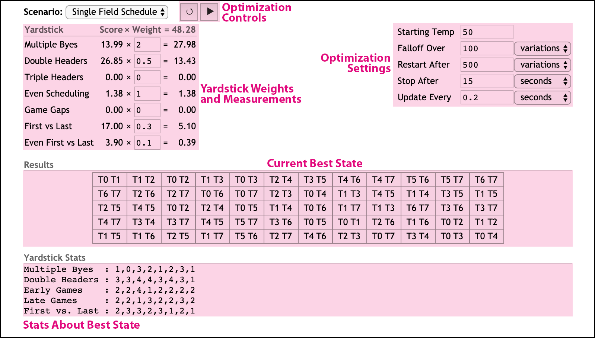

Rephinez (pronounced "[RAYF FYNZ](https://en.wikipedia.org/wiki/Ralph_Fiennes)")
is a generic tool for optimizating hard-to-solve problems through a bit
of brute force, a bit of luck, and a bit of artistry.

For example, maybe you want to create a really "good" schedule for your sports
league. You provide:

* An initial schedule (good or bad).
* A method for taking one schedule and producing a _slightly_ different one
  (better or worse).
* One or more methods that measure the schedule and tell how "good" or "bad"
  it is.

Rephinez will (with a little help from you) keep varying the schedule, guiding
towards a really good one.

Rephinez uses [simulated annealing](https://en.wikipedia.org/wiki/Simulated_annealing)
to "solve" what would otherwise be nightmare problems in combinatorics.
It doesn't find the absolute best result, but it finds ones that are quite good,
relatively quickly. This takes a little bit of art and finesse from you to help
tune the algorithm as it runs. More on that below.

<!-- @import "[TOC]" {cmd="toc" depthFrom=1 depthTo=6 orderedList=false} -->

<!-- code_chunk_output -->

- [Installing](#installing)
- [Running via the Web Interface](#running-via-the-web-interface)
- [Running via Command Line](#running-via-command-line)
  - [Modifying Yardsticks & Weights](#modifying-yardsticks-weights)
  - [Modifying Run Parameters](#modifying-run-parameters)
- [Creating a New Scenario](#creating-a-new-scenario)
  - [The Scenario Description](#the-scenario-description)
  - [Varying your States](#varying-your-states)
  - [Writing Yardsticks](#writing-yardsticks)
  - [Picking the Right Optimization Values](#picking-the-right-optimization-values)
  - [Example Scenarios](#example-scenarios)
- [Saving and Restoring States](#saving-and-restoring-states)
- [TODO](#todo)
- [History](#history)
- [License & Contact](#license-contact)

<!-- /code_chunk_output -->


# Installing
Rephinez requires [Node.js](https://nodejs.org/en/), and runs on a wide variety
of operating systems.

The easiest way to get the project is to use [Git](https://git-scm.com/) to pull
the source code:

```sh
# creates and fills a directory `rephinez`
git clone https://github.com/Phrogz/rephinez.git
cd rephinez
npm install # install necessary software dependencies
```


# Running via the Web Interface

1. Launch the web server.

   ```sh
   node webserver.js
   ```

2. Open a web browser and visit `http://localhost:8080`; you will see a list of
   scenarios with none selected:
   

3. Select a scenario to work on from the pull down menu, and you will see the
   yardsticks, simulation controls, initial scenario, and yardstick stats: 

4. Review and adjust the Yardstick weights and their impact on the final score.
   Yardsticks resulting in a higher score will more heavily impact the state
   than those producing lower scores. Lower scores are better; an overall score
   of "0.0" indicates the perfect result.

   Setting a weight to `0` will disable that yardstick.

5. Review the optimization settings, primarily to ensure that your simulation
   will stop after a reasonable amount of time, giving you a chance to change
   settings and continue.

   * **Starting Temp** — Controls the initial temperature to use at the
     beginning of each optimization round. Higher temperatures make it more
     likely for the simulation to accept changes that increase the score. The
     amount of heat needed is partially dependent upon the overall score of the
     state; if you feel that your optimization is getting stuck, increase the
     temperature, or lower the yardstick weightings.

   * **Falloff Over** — The temperature will asymptotically falloff towards zero
     during a round. This setting controls how long it takes for the temperature
     to reach 1% of the starting temp. Cooling off more slowly takes more time,
     but can help ensure that your state works out bad kinks. Cooling off too
     fast may lock in certain bad choices.

   * **Restart After** — As the simulation cools off, eventually your
     optimization will stall, unable to make any variations that help the
     overall score. At this point we want the simulation to heat back up again.
     This setting controls how long an optimization continues before we reset to
     the best state we've found so far, turn up the heat, and start a new round.

   * **Stop After** — When initially experimenting with a scenario you want to
     be able to periodically try different yardstick weights or temperatures.
     This setting controls how long the optimization runs before stopping,
     setting the current state to the best state found so far, and yielding
     control back to you. When you feel like you've done the best you can, but
     want to see if brute force can help, increase this value (and maybe that of
     _Restart After_) and walk away from the computer for a while.

   * **Update Every** — It's hard to wait and do nothing. This setting controls
     how frequently the optimization pauses and sends the best state back to the
     web browser, so that you can watch along, see how things are going, and
     plan for your next change.

6. Finally, when you are ready, press the "Play" button (▶) at the top of the
   screen to begin the optimization. The controls will be replaced with a
   progress bar while the optimization is in progress.

   

   When the progress can be determined—when "Stop After" is not based on a final
   score—the progress bar will fill with green as the progress continues.

   Each time the progress finishes, not only are you shown the `html` version of
   the current best state on screen, but a serialized version of the state will
   be saved in the `data` directory for your scenario.

When the current optmization pass has finished, you can tweak the values in the
interface and press Play (▶) again to continue optimization from the current
state.

Alternatively, if you think that the state has perhaps gotten stuck in a local
minima, press the Reset button (↺). This will reload the scenario file (in case
you've made local changes; no need to restart the web server), and also reset
the optimization settings and yardstick weights to those specified in the file.


# Running via Command Line

```text
usage: node rephinez.js -s "Hat Shuffler" [-L] [--set ...] [-d] [-h] [--weights ...]
   --scenario, -s : [required] Name of the scenario to use
   --latest,   -L : Use the latest file in the data folder as the initial state
   --load,     -l : File in the data folder to load as the initial state
   --set,      -v : Override scenario settings; multiple values can be specified
   --weights,  -w : Override scenario yardstick weights; multiple weights can be specified
   --debug,    -d : Show debug messages during execution
   --help,     -h : Show this message

Examples:
node rephinez.js -s "Hat Shuffler"
node rephinez.js -s "Hat Shuffler" -L
node rephinez.js -s "Hat Shuffler" -L --set tempStart:10 tempFalloffTime:2
node rephinez.js -s "Hat Shuffler" -L -s tempStart:10 -w "Fair Teams":7
```

Each invocation of the program will optimize a scenario, showing progress during
the evaluation, and then will write a saved version of the best state at the
end.

To tweak parameters and run again, use the `--latest` parameter. This will load
the last-saved state from disk as the initial state and optimize starting from
that point.

## Modifying Yardsticks & Weights

While the web interface allows you to change the _weights_ on yardsticks between
optimization runs, it does not allow you to change the yardstick code, or add
new yardsticks, between runs. The command-line version reloads the scenario and
yardstick code fresh each launch, allowing you to develop your optimization
while you optimize.

In addition to changing the yardstick weightings in the scenario file, you can
use the `--weights` command line parameter to override yardstick weights. For
example:

```
node rephinez.js -s "My Schedule" --weights "Yardstick 1":0.5 "Yardstick 2":17
```

…will set the weightings for those yardsticks to `0.5` and `17` respectively.


## Modifying Run Parameters

Editing the `scenario.js` file can be an easy way to tweak the temperature
settings, the restart, or how long the optimization runs. More convenient,
however, is to use the `--set` command line parameter to tweak these values
between runs.

I find it convenient to try out many different runs with `stopAfterTime:30` and
`checkinAfterTime:0.5` to watch 30 seconds of optimizations in an attempt to
feel whether the weightings I have and temperatures I'm using are right. This
might look like:

```sh
node rephinez.js -s "My Schedule" \
  --weights "Triple Headers":50 "Double Headers":0.5 "Multiple Byes":5 \
  --set tempStart:10 tempFalloffVariations:30 restartAfterVariations:100
```

Once I feel that it's time to test out a good run, however, I want to let it run
for an hour, and report progress back infrequently:

```sh
node rephinez.js -s "My Schedule"\
  --weights "Triple Headers":50 "Double Headers":0.5 "Multiple Byes":5 \
  --set tempStart:10 tempFalloffVariations:30 restartAfterVariations:100 \
        stopAfterTime:3600 checkinAfterTime:5
```


# Creating a New Scenario

A "scenario" describes the problem you are trying to solve.

All the code for your scenario gets placed as a directory inside the `scenarios`
directory. For example, if you are trying to solve your league's scheduling
problems, you might create a directory named `scenarios/My Scheduler/`.

Example scenarios are already in the `scenarios` directory to help guide you to
creating your own scenario. See the README.md file in each directory for more
details.

## The Scenario Description

Your scenario must have a file named `scenario.js` at the root of your
scenario's directory. This file must export an object as shown:

```js
module.exports = {
    name: '...',             // (optional) the display name of your scenario

    /*** functions related to states *****************************************************************/
    initial: ƒ,  // a function that produces the initial "state" to start with
    vary:    ƒ,  // a function/method that takes one state and creates a new, slightly different state
    clone:   ƒ,  // (optional) a function/method that takes one state and returns a copy of it
    html:    ƒ,  // for the web interface, a function/method that returns a web-friendly representation of the state
    save:    ƒ,  // a function/method that serializes the state to a string
    load:    ƒ,  // a function that converts a serialized state into a real one

    tempStart: 5, // temperature to use when starting a round of optimization

    /*** controlling the temperature falloff (pick only one) ***/
    tempFalloffTime:            2, // number of seconds after which it should reach one percent of tempStart
    tempFalloffVariations:    200, // number of variations after which it should reach one percent of tempStart

    /*** how often to peek at the optimization progress (pick only one) ***/
    checkinAfterTime:           1, // invoke the 'checkin' callback every this-many seconds
    checkinAfterVariations:   100, // invoke the 'checkin' callback every this-many variations
    checkinAfterScore:        0.5, // invoke the 'checkin' callback every this-many score improvements

    /*** (optional) occasionally restart optimization, starting from the best state (pick only one) ***/
    restartAfterTime:           3, // restart a new round after this many seconds in the round
    restartAfterVariations:   5e2, // restart a new round after this many variations in the round
    restartAfterScore:         20, // restart a new round if a score greater than or equal to this is accepted
    restartAfterTemperature: 1e-6, // restart a new round if the temperature falls below this

    /*** when to stop and serialize the optimization (pick only one) ***/
    stopAfterTime:             99, // stop optimization after this many seconds
    stopAfterVariations:      1e5, // stop optimization after this many variations
    stopAfterScore:             0, // stop optimization if a measurement produces a score less than or equal to this
    stopAfterRounds:          1e3, // stop optimization after this many rounds have been exhausted

    // rankings to run, and the default importance of each ranking relative to the others
    yardsticks: {
        "Yardstick 1 Name":   3.2,
        "Another Yardstick":  1.7,
        "My Final Yardstick":  91,
        ...
    }
}
```

The `vary`, `save`, `html`, and `clone` functions are all invoked with the state
as the `this` context, as well as passing the state as a parameter. This allows
you to use class instances for your states and supply methods that operate on
the instance, or write functions that take the state as a parameter. For
example:

```js
class Route {
    constructor()      { /* ... */ }
    swapRandomCities() { /* ... */ }
    duplicate()        { /* ... */ }
    serialize(format)  { /* ... */ }
}
module.exports = {
    initial : () => new Route(),
    vary    : Route.prototype.swapRandomCities,
    clone   : Route.prototype.duplicate,
    save    : route => route.serialize('csv'),
    /* ... */
}
```

## Varying your States

When writing code to create a new state from another one it is important that
you do NOT attempt to make the state better in the process. If you do so, you
are very likely to get stuck in a "local minimum", a spot where there is no
single "good" change your algorithm could make that would improve the state, yet
if you made a handful of "bad" changes first then you would be able to get to a
far, far better state.

At its heart, the runtime takes the current state, varies it, measures the new
variation, and compares the scores between the old state and the new variation.
Based on the scores and the current temperature, it may decide to discard the
variation and keep what was the 'current' state. If your state is immutable—e.g.
a number—then this is not a problem. However, most complex states are
represented by mutable objects. When your `vary` function changes the state to
produce a new state, it is also changing the _current best_ state.

The `clone` function is required to combat this problem. If your states are
immutable, do not specify a value for this. If, however, your states _are_
mutable, then you must supply a `clone` function. This allows the runtime to
duplicate the current state before calling your `vary` function, and then decide
which to keep.


## Writing Yardsticks

Yardsticks measure how bad a particular state is for a particular desire. The
ideal state would measure `0.0` on every yardstick.

Your scenario directory must have a `yardsticks` subdirectory with one or more
modules in it, whose filenames without the `.js` extension match the names
supplied in your `yardsticks` description. If you have a file in the directory,
but the name is not mentioned in the scenario.js `yardsticks` map, that
yardstick will not be run.

Yardstick modules must export a function that takes the current state as a
parameter and returns an object with 1-2 keys:

* The **`score`** key is required, and must be a non-negative floating point
  number. The higher the score, the _**worse**_ the state is according to this
  yardstick.

* The **`stats`** key is optional. It is used to provide insight into why the
  yardstick is producing its score. If present, `stats` must be an object with
  one or more keys. Each key is a label that will be displayed before the value
  as a string.

```js
// yardsticks/Distributed Speed.js
// Does each team have the same number of fast people?
module.exports = function(season) {
    const players = season.teams.map(t => t.players.filter(p=>p.speedy).length)
    return {
        /* Multiply by 10 to bring it closer to other scores */
        score: players.standardDeviation() * 10,
        stats: {
            /* show a count of how many fast players each team has */
            "Speedy Players per Team":players.join(' ')
        }
    }
}
```

## Picking the Right Optimization Values

* `tempStart`, `tempFalloff*` - heavily affect how quickly the optmization works
  (or if at all!)
  * If these are too high, the annealer will keep allowing terrible choices,
    getting your state into a one that is hard to recover from.
  * If these are too low, the annealer will never take a chance on a bad
    variation, and it's likely your state will get stuck in a local minimum. If
    you see your states getting stuck at a score that is not where you want it
    to be, try raising the temperature, or spending more time at higher temps.

* `checkinAfter*` - mostly up to your preference
  * If it is too infrequent, you'll bite your fingernails dying to find out if
    things are going well.
  * If it is too frequent, you'll slow down the computer as it wastes time
    keeping you informed instead of trying out variations.

* `resetAfter*` - can heavily affect how quickly the optimization works

  Optimization of a state usually requires many attempts. A high initial
  temperature lets the system try out some possibly-dumb choices, and then as
  the temperature lowers it tries to improve upon those. Many times the result
  is not even as good as the state it started with. So, you need to reset to the
  previous best and try again.

  The `restartAfter*` options in the scenario description provide a mechanism
  for doing this automatically. Consider this combination of settings:

  ```js
  {
    tempStart:               10,
    tempFalloffVariations:   20,
    restartAfterVariations: 100,
    stopAfterTime:           60
    // ...
  }
  ```

  The above will run 20 variations from 10° down to 0.1°, and then another 80
  variations with the temperature falling further still. At that point, if the
  state is not better than where it started, it will start over, again and again
  and again, for one minute. Depending on how fast your scenario variation and
  yardsticks run, this might try out millions of variations, discarding tens of
  thousands of dead-ends and starting over a the last-known best scenario.
  * If this is too high, you will waste time persuing dead-ends.
  * If this is too low, you may be forcing the optimizer to give up on a state
    that could have been promising with more variations allowed.

* `stopAfter*` - how long you let the optimization run is up to your preference
  * If it is too high, you'll have to wait a long time before you can tweak
    rankings or temperatures.
  * If it is too low, you'll have to keep re-running more often to start a new
    optimization after each run.

## Example Scenarios

As mentioned above, the `scenarios` directory has several scenarios which
illustrate techniques for authoring, optimizing, and visualizing the work. Each
has a README file providing an in-depth description, but in brief:

* **[Max Seeker](scenarios/Max%20Seeker/README.md)** - a simple scenario with a
  single yardstick trying to find the maximum value of a function within a
  specific domain.
* **[Traveling Diner](scenarios/Traveling%20Diner/README.md)** - a "Traveling
  Salesman" problem which attempts to not only minimize the travel distance, but
  to simultaneously impose a restriction on the order in which sites are
  visited. It also shows how to use SVG instead of HTML to visualize the current
  state.
* **[Single Field Schedule](scenarios/Single%20Field%20Schedule/README.md)** - a
  real-world problem of scheduling multiple sports teams to play on a single
  field, with many sometimes-conflicting desires for what represents a "perfect"
  schedule.
* **[Hat Shuffler](scenarios/Hat%20Shuffler/README.md)** - a real-world problem
  of scheduling a sports league where players are put on different teams each
  round, trying to ensure players get to play with most everyone, that the teams
  are "fair", while allowing players who want to play together to stay together.

# Saving and Restoring States

Every time an optimization run completes a file is saved in the `data` folder of
your scenario, named with the current date and time, e.g.
`state-20190322T150550.csv`. The contents of this file are generated by calling
your scenario's `save` function. This function must return an object with two
keys:

* `content`: a string with the text content of your saved state
* `type`: a string with the file extension to use (e.g. `"txt"`, `"json"`,
  `"csv"`, etc.)

When loading saved states (currently only possible when running from the command
line), the contents of a save file will be supplied to your `load()` function;
that function must return a valid state to optimize.


# TODO

* Rewrite asynchronous worker update to avoid [this problem](https://stackoverflow.com/questions/58425134/forcing-synchronous-node-js-ipc)
* Allow web UI to browse saved states and load them
* Allow web UI to reset the initial state *without* resetting weights or simulation parameters
* Finish Max Seeker example to have canvas-based graphical update
* Graphs of best score vs current score

# History

* ...still awaiting an initial release...


# License & Contact

Rephinez is copyright ©2019-2023 by Gavin Kistner and is licensed under the
[MIT License](http://opensource.org/licenses/MIT).
See the LICENSE file for more details.

For bugs or feature requests please open [issues on GitHub](https://github.com/Phrogz/rephinez/issues).
For other communication you can [email the author](mailto:!@phrogz.net?subject=Rephinez) directly.
