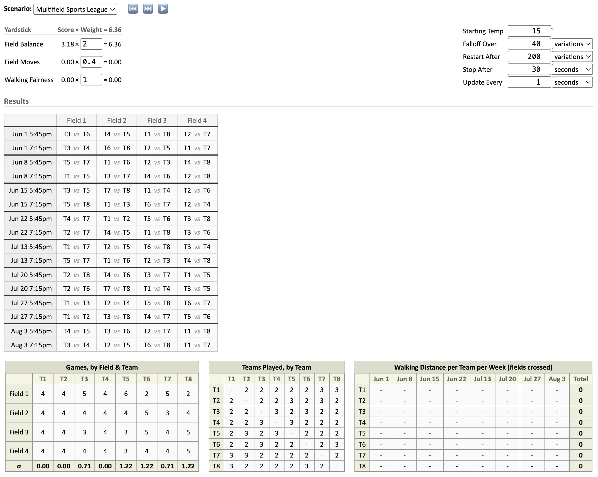

# Multifield Sports League

This scenario schedules a league where multiple teams play simultaneously on
adjacent fields, with two time slots per evening across several weeks. It was
built for an outdoor Ultimate Frisbee league with 8 teams, 4 fields, and 8 evenings.

The number of teams, fields, weeks, dates, and time slots are all hardcoded at
the top of `scenario.js` (the `DATES`, `ISO_DATES`, `TIMES`, `TIMES_24`,
`TEAM_NAMES`, `TEAM_NAMES_LONG`, and `FIELD_NAMES` constants). Change them there
to adapt to a different league size or calendar.

## Initial Setup

A round-robin is generated so that every pair of teams meets a balanced number
of times. Each time slot is a complete partition: every team plays exactly once
per slot. The round-robin is then laid across weeks and slots in order.

## Variations

Variations only rearrange which *field* a game is played on within its existing
slot. Matchups, week assignments, and slot assignments are never altered. Two
operators are used:

* **swapFieldsInSlot** (90%) — pick a slot, swap two games' field assignments.
* **reverseSlot** (10%) — reverse the field order of an entire slot, escaping
  local minima that single swaps cannot.

## Yardsticks

* **Field Balance** — each team should play on each field a similar number of
  times across the season.
* **Field Moves** — minimize how far teams walk between fields during an
  evening.
* **Walking Fairness** — whatever walking happens should be shared fairly across
  teams.
* **Even Matchups** — every pair of teams should meet a similar number of times.
  Disabled by default because the current variation operators never change
  matchups.
* **Back-to-Back Repeats** — a matchup should not repeat in two consecutive time
  slots, including across weeks. Disabled by default because the current
  variation operators never change matchups.
* **First-cycle Completeness** — every team should play every other team at least
  once before any rematches. Disabled by default because the current variation
  operators never change matchups.

## Saving and Loading

The schedule can be saved and loaded as a CSV in
[TopScore / Ultimate Central upload format](https://help.ultimatecentral.com/support/solutions/articles/166892-schedule-upload-format).
Saved states are stored under `data/`.
